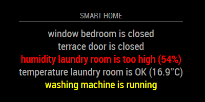
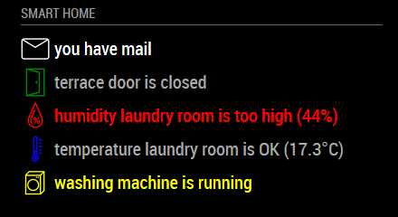
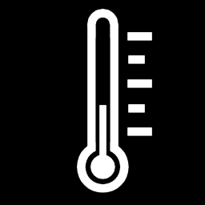

# MMM-Homematic
HomeMatic Module for MagicMirror

This an extension for [MagicMirror](https://github.com/MichMich/MagicMirror) that shows values from [HomeMatic](https://www.homematic.com/) smart home components and system variables.

This module makes use of the [XML-API](https://github.com/hobbyquaker/XML-API), which must be installed on your HomeMatic CCU to read the sensor values from.

This module supports output of text, icons and text or icons only.






## Installation
1. Navigate into your MagicMirror's `modules` folder and execute `git clone https://github.com/Sickboy78/MMM-Homematic`. A new folder will appear.
2. Add it to the modules array in the `config/config.js` (see next steps below)

## Using the module

To use this module, add it to the modules array in the `config/config.js` file:
````javascript
modules: [
	{
		module: 'MMM-Homematic',
		position: 'top_center',
		header: 'SMART HOME',
		config:	{
			ccuHost: 'ccu3-webui',	// hostname of your ccu (e.g. for CCU3 default is "ccu3-webui")
			tempUnit: "°C",			// unit of your temperatur values
			datapoints: [			// the datapoints of your HomeMatic devices/sensors
				{
					id: "2297",
					name: "window Living Room",
					type: "window_warn_open",
					warnOnly: "true"
				},
				{
					id: "1274",
					name: "humidity Laundry Room",
					type: "hum_warn_high",
					threshold: 60
				},
				{
					id: "1264",
					name: "temperatur Laundry Room",
					type: "temp_warn_low",
					threshold: 10
				},
				{
					id: "11104",
					name: "washing machine",
					type: "mashine_warn_running",
					warnOnly: "false"
				},
				{
					id: "2904",
					name: "Debug-Level = ",
					type: "sysvar_number_warn_high",
					precision: 2,
					threshold: 2,
					warnColor: "blue",
				},
				{
					id: "12050",
					name: "Who is there? ",
					type: "stringvalue",
					warnOnly: "false"
				},
				{
					id: "12047",
					name: "NAME",
					type: "presence_warn_here",
					warnOnly: "false"
				},
				{
					id: "1831",
					name: "Today",
					type: "sysvar_valuelist_warn_equals",
					reference: "monday",
					warnColor: "red"
				}
			]
		}
	}
]
````

HomeMatic is a registered trademark of [eQ-3 AG](https://www.eq-3.de/)

Extension of this module with system variables, switches and more tested devices by @spitzlbergerj

## Howto get your datapoint IDs

* Install the XML-API on your HomeMatic CCU. Installation guide can be found here: [XML-API](https://github.com/hobbyquaker/XML-API)

* For datapoints from sensors or actors call the list of devices via the XML-API using http://ccu3-webui/addons/xmlapi/devicelist.cgi, replacing 'ccu3-webui' with the hostname or IP address of your CCU. For system variables call http://ccu3-webui/addons/xmlapi/sysvarlist.cgi

* Find the ise_id of your device or system variable in the output, which may look like this:
````
...
<device name="window contact living room" address="001098A98A1C03" ise_id="2086" interface="HmIP-RF" device_type="HmIP-SWDO-I" ready_config="true">
<channel name="window contact living room:0" type="30" address="001098A98A1C03:0" ise_id="2087" direction="UNKNOWN" parent_device="2086" index="0" group_partner="" aes_available="false" transmission_mode="AES" visible="true" ready_config="true" operate="true"/>
<channel name="HmIP-SWDO-I 001098A98A1C03:1" type="37" address="001098A98A1C03:1" ise_id="2115" direction="SENDER" parent_device="2086" index="1" group_partner="" aes_available="false" transmission_mode="AES" visible="true" ready_config="true" operate="true"/>
</device>
...
````
In this case we are looking for the ise_id of the device "window contact living room", which is "2086".
Or for system variables the output may look like this:
````
...
<systemVariable name="presence.person1" variable="1" value="true" value_list="" ise_id="12047" min="" max="" unit="" type="2" subtype="2" logged="true" visible="true" timestamp="1548509644" value_name_0="abwesend" value_name_1="anwesend"/>
<systemVariable name="presence.string" variable="person1,person2,person3" value="person1,person2,person3" value_list="" ise_id="12050" min="" max="" unit="" type="20" subtype="11" logged="false" visible="true" timestamp="1548509644" value_name_0="" value_name_1=""/>
<systemVariable name="washing mashine" variable="0" value="false" value_list="" ise_id="11104" min="" max="" unit="" type="2" subtype="2" logged="true" visible="true" timestamp="1548444197" value_name_0="not running" value_name_1="running"/>
</systemVariables>
...
````
In this case we are looking for the ise_id of the system variable "washing mashine", which is "11104".

Next two steps are only necessary for datapoints of sensors or actors. For system variables you can skip them and go directly to the last step.

* Call the state of the device via the XML-API using http://ccu3-webui/addons/xmlapi/state.cgi?device_id=1234, replacing 'ccu3-webui' with the hostname or IP address of your CCU and '1234' with the ise_id from the previous step.

* Find the ise_id of the desired datapoint of your device in the output.
<br>For window/door contact sensors it is the datapoint of type="STATE", for temperature sensors it is the datapoint with the type="ACTUAL_TEMPERATURE", for humidity sensors its type="HUMIDITY" and for shutter actuators it's type="LEVEL".
<br>The output may look like this:
````
<state>
<device name="window contact living room" ise_id="2086" unreach="false" config_pending="false">
<channel name="window contact living room:0" ise_id="2087">
...
</channel>
<channel name="HmIP-SWDO-I 001098A991646A:1" ise_id="2296">
<datapoint name="HmIP-RF.001098A991646A:1.STATE" type="STATE" ise_id="2297" value="0" valuetype="16" valueunit="""" timestamp="1546779254"/>
</channel>
</device>
</state>
````
In this case we are looking for the ise_id of the datapoint of type="STATE" of the device "window contact living room", which is "2297".
<br>Or the output looks like this:
````
<state>
<device name="climate sensor laundry room" ise_id="1238" unreach="false" config_pending="false">
<channel name="climate sensor laundry room:0" ise_id="1239">
...
</channel>
<channel name="HmIP-STHD 000E98A991C6C7:1" ise_id="1262">
<datapoint name="HmIP-RF.000E98A991C6C7:1.ACTIVE_PROFILE" type="ACTIVE_PROFILE" ise_id="1263" value="1" valuetype="16" valueunit="" timestamp="1546779623"/>
<datapoint name="HmIP-RF.000E98A991C6C7:1.ACTUAL_TEMPERATURE" type="ACTUAL_TEMPERATURE" ise_id="1264" value="16.800000" valuetype="4" valueunit="" timestamp="1546779623"/>
<datapoint name="HmIP-RF.000E98A991C6C7:1.ACTUAL_TEMPERATURE_STATUS" type="ACTUAL_TEMPERATURE_STATUS" ise_id="1265" value="0" valuetype="16" valueunit="" timestamp="1546779623"/>
...
</channel>
</device>
</state>
````
In this case we are looking for the ise_id of the datapoint of type="ACTUAL_TEMPERATURE" of the device "climate sensor laundry room", which is "1264".

* Use the ise_id from the previous step as ID for your datapoint in the module config.

## Tested devices

<table width="100%">
  <thead>
    <tr>
      <th>Type</th>
      <th width="100%">Description</th>
      <th>datapoint type</th>
    </tr>
  <thead>
  <tbody>
    <tr>
	  <td>window</td>
	  <td>HomeMatic IP Window / Door Contact (HmIP-SWDO-I)</td>
	  <td>type="STATE"</td>
	</tr>
    <tr>
	  <td>window</td>
	  <td>HomeMatic Window / Door Contact optical (HM-Sec-SCo)</td>
	  <td>type="STATE"</td>
	</tr>
    <tr>
	  <td>temp</td>
	  <td>HomeMatic IP Temperature and Humidity Sensor with Display (HmIP-STHD)</td>
	  <td>type="ACTUAL_TEMPERATURE"</td>
	</tr>
    <tr>
	  <td>temp</td>
	  <td>HomeMatic radiator thermostat (HM-CC-RT-DN)</td>
	  <td>type="ACTUAL_TEMPERATURE"</td>
	</tr>
    <tr>
	  <td>temp</td>
	  <td>HomeMatic radiator thermostat (HM-CC-RT-DN)</td>
	  <td>type="SET_TEMPERATURE"</td>
	</tr>
    <tr>
	  <td>temp</td>
	  <td>HomeMatic wall thermostat (HM-TC-IT-WM-W-EU)</td>
	  <td>type="ACTUAL_TEMPERATURE"</td>
	</tr>
    <tr>
	  <td>temp</td>
	  <td>HomeMatic wall thermostat (HM-TC-IT-WM-W-EU)</td>
	  <td>type="SET_TEMPERATURE"</td>
	</tr>
    <tr>
	  <td>hum</td>
	  <td>HomeMatic IP Temperature and Humidity Sensor with Display (HmIP-STHD)</td>
	  <td>type="HUMIDITY"</td>
	</tr>
    <tr>
	  <td>hum</td>
	  <td>HomeMatic wall thermostat (HM-TC-IT-WM-W-EU)</td>
	  <td>type="ACTUAL_HUMIDITY"</td>
	</tr>
    <tr>
	  <td>shutter</td>
	  <td>HomeMatic Wireless Shutter Actuator 1-channel, flush-mount (HM-LC-Bl1PBU-FM)</td>
	  <td>type="LEVEL"</td>
	</tr>
    <tr>
	  <td>switch</td>
	  <td>HomeMatic Wireless Switch Actuator 1-channel, flush-mount (HM-LC-Sw1-FM)</td>
	  <td>type="STATE"</td>
	</tr>
    <tr>
	  <td>switch</td>
	  <td>HomeMatic Wireless Switch Actuator 2-channel, flush-mount (HM-LC-Sw2-FM)</td>
	  <td>type="STATE"</td>
	</tr>
    <tr>
	  <td>other</td>
	  <td>Wireless Switch Actuator 1-channel with power metering, plug adapter type F (HM-ES-PMSw1-Pl)</td>
	  <td>type="ENERGY_COUNTER"</td>
	</tr>
    <tr>
	  <td>other</td>
	  <td>Wireless Switch Actuator 1-channel with power metering, plug adapter type F (HM-ES-PMSw1-Pl)</td>
	  <td>type="POWER"</td>
	</tr>
    <tr>
	  <td>other</td>
	  <td>Wireless Switch Actuator 1-channel with power metering, plug adapter type F (HM-ES-PMSw1-Pl)</td>
	  <td>type="CURRENT"</td>
	</tr>
    <tr>
	  <td>other</td>
	  <td>Wireless Switch Actuator 1-channel with power metering, plug adapter type F (HM-ES-PMSw1-Pl)</td>
	  <td>type="VOLTAGE"</td>
	</tr>
    <tr>
	  <td>other</td>
	  <td>Wireless Switch Actuator 1-channel with power metering, plug adapter type F (HM-ES-PMSw1-Pl)</td>
	  <td>type="FREQUENCY"</td>
	</tr>
  </tbody>
</table>

## Tested System variable types

<table width="100%">
  <thead>
    <tr>
      <th>Type</th>
      <th width="100%">Description</th>
    </tr>
  <thead>
  <tbody>
    <tr>
	  <td>boolean</td>
	  <td>Display of the two possible values true or false as e.g. "is ok" or "is not ok". The textual representation of the two values is the same for all logic system variables.</td>
	</tr>
    <tr>
	  <td>alarm</td>
	  <td>Display of the two possible values true or false as e.g. "triggered" or "not triggered". The textual representation of the two values is the same for all alarm system variables.</td>
	</tr>
    <tr>
	  <td>boolean, mashine state</td>
	  <td>As before, but special logic value for e.g. machines whose status is to be displayed as running or not running. </td>
	</tr>
    <tr>
	  <td>boolean, presence state</td>
	  <td>As before, but special logic value presence for e.g. persons who can be here or not here. </td>
	</tr>
    <tr>
	  <td>string</td>
	  <td>Displays the character string stored in the system variable.</td>
	</tr>
    <tr>
	  <td>number</td>
	  <td>Displays the numeric value of the system variable.</td>
	</tr>
    <tr>
	  <td>value list</td>
	  <td>Displays the currently selected value of the value list.</td>
	</tr>
  </tbody>
</table>

## Default icons

<table width="100%">
  <thead>
    <tr>
      <th>Name</th>
      <th width="100%">Icon</th>
    </tr>
  <thead>
  <tbody>
    <tr>
	  <td>default_icon_mail</td>
	  <td></td>
	</tr>
    <tr>
	  <td>default_icon_presence</td>
	  <td></td>
	</tr>
    <tr>
	  <td>default_icon_temp</td>
	  <td></td>
	</tr>
    <tr>
	  <td>default_icon_hum</td>
	  <td></td>
	</tr>
    <tr>
	  <td>default_icon_window</td>
	  <td></td>
	</tr>
    <tr>
	  <td>default_icon_door</td>
	  <td></td>
	</tr>
    <tr>
	  <td>default_icon_shutter</td>
	  <td></td>
	</tr>
    <tr>
	  <td>default_icon_socket_eu</td>
	  <td></td>
	</tr>
    <tr>
	  <td>default_icon_socket_us</td>
	  <td></td>
	</tr>
    <tr>
	  <td>default_icon_washmachine</td>
	  <td></td>
	</tr>
  </tbody>
</table>

## Configuration options

<table width="100%">
  <thead>
    <tr>
      <th>Option</th>
      <th width="100%">Description</th>
    </tr>
  <thead>
  <tbody>
    <tr>
      <td><code>ccuProtocol</code></td>
      <td>The protocol to use for your CCU.
		<br>Most likely default value is good.
        <br><b>Possible values:</b> <code>http://</code> - <code>https://</code>
        <br><b>Default value:</b> <code>http://</code>
      </td>
    </tr>
    <tr>
      <td><code>ccuHost</code></td>
      <td>The hostname of your CCU.
		<br>Depends on your version of CCU.
		<br>For CCU1 you have to give your CCU a fixed IP address and use it.
		<br>For CCU2 it is most likely "homematic-ccu2".
		<br>For CCU3 it is most likely "ccu3-webui" (default).
		<br>For RaspberryMatic it is the hostname you have set in the network settings of your Raspberry PI.
		<br><b>Default value:</b> <code>ccu3-webui</code>
      </td>
    </tr>
    <tr>
      <td><code>ccuXmlApiUrl</code></td>
      <td>The URL path of the XML API.
	    <br>Most likely default value is good.
	    <br>But may change with newer versions of XML API, see <a href="https://github.com/hobbyquaker/XML-API">XML-API</a>.
	    <br><b>Default value:</b> <code>/addons/xmlapi</code>
      </td>
    </tr>
    <tr>
      <td><code>ccuStateServiceUrl</code></td>
      <td>The name of the XML API Service for getting states/values from devices/datapoints.
	    <br>Most likely default value is good.
	    <br>But may change with newer versions of XML API, see <a href="https://github.com/hobbyquaker/XML-API">XML-API</a>.
	    <br><b>Default value:</b> <code>/state.cgi</code>
      </td>
    </tr>
    <tr>
      <td><code>ccuSysvarServiceUrl</code></td>
      <td>The name of the XML API Service for getting values from system variables of type value list.
	    <br>Most likely default value is good.
	    <br>But may change with newer versions of XML API, see <a href="https://github.com/hobbyquaker/XML-API">XML-API</a>.
	    <br><b>Default value:</b> <code>/sysvar.cgi</code>
      </td>
    </tr>
    <tr>
      <td><code>ccuDatapointIdParameter</code></td>
      <td>The name of the URL Parameter expected by the XML API Service to identify a datapoint of a device.
	    <br>Most likely default value is good.
	    <br>But may change with newer versions of XML API, see <a href="https://github.com/hobbyquaker/XML-API">XML-API</a>.
	    <br><b>Default value:</b> <code>?datapoint_id=</code>
      </td>
    </tr>
    <tr>
      <td><code>ccuIseIdParameter</code></td>
      <td>The name of the URL Parameter expected by the XML API Service to identify a system variable.
	    <br>Most likely default value is good.
	    <br>But may change with newer versions of XML API, see <a href="https://github.com/hobbyquaker/XML-API">XML-API</a>.
	    <br><b>Default value:</b> <code>?ise_id=</code>
      </td>
    </tr>
    <tr>
      <td><code>tempUnit</code></td>
      <td>The unit of temperature.
        <br><b>Possible values:</b> <code>°C</code> - <code>°F</code> - <code>K</code>
        <br><b>Default value:</b> <code>°C</code>
      </td>
    </tr>
    <tr>
      <td><code>humUnit</code></td>
      <td>The unit of humidity.
        <br><b>Possible values:</b> <code>%</code> - <code>g/m³</code>
        <br><b>Default value:</b> <code>%</code>
      </td>
    </tr>
    <tr>
      <td><code>shutterUnit</code></td>
      <td>The unit of the shutter actuator.
        <br><b>Possible values:</b> <code>%</code> - <code>pc</code>
        <br><b>Default value:</b> <code>%</code>
      </td>
    </tr>
    <tr>
      <td><code>locale</code></td>
      <td>String for country-specific formatting of numbers.
        <br><b>Possible values:</b> see <a href="https://tools.ietf.org/html/rfc5646">Tags for Identifying Languages</a>
		<br><b>Example values:</b> <code>de-DE</code> - <code>en-US</code>
        <br><b>Default value:</b> <code>config.language(default:en)</code>
      </td>
    </tr>
    <tr>
      <td><code>datapoints</code></td>
      <td>An array of datapoint objects.
		<br>Each datapoint object represents one value/state of a device.
		<br><b>Example value:</b>
		<br><code>[{
		<br>id: 1234,
		<br>name: "front door",
		<br>type: window_warn_open,
		<br>},{
		<br>id: 4711,
		<br>name: "humidity laundry room",
		<br>type: "hum_warn_high",
		<br>threshold: "60"
		<br>}]</code>
      </td>
    </tr>
    <tr>
      <td><code>id</code></td>
      <td>The ID of the datapoint to read a value from.
	  <br>This value is required.
	  <br>On howto get your ID see <a href="#howto-get-your-datapoint-ids">Howto get your datapoint IDs</a>.
	  <br><b>Example value:</b> <code>1234</code>
      </td>
    </tr>
    <tr>
      <td><code>name</code></td>
      <td>The display name of the device/datapoint.
	  <br>This value is required.
	  <br><b>Example values:</b> <code>
	  <br>"front door"
	  <br>"temperature living room"</code>
      </td>
    </tr>
    <tr>
      <td><code>type</code></td>
      <td>The type of the device/datapoint.
	  <br>This value is required.
	  <br>Depends on the datapoint/device you want to display.
	  <br>For a list of tested devices see <a href="#tested-devices">Tested devices</a>.
	  <br><b>Possible values for devices:</b>
	  <br><code>window</code> - A door or window sensor. (e.g. a HomeMatic IP Window / Door Contact)
	  <br><code>window_warn_open</code> - Same as 'window', but with a warning if open.
	  <br><code>window_warn_closed</code> - Same as 'window', but with a warning if closed.
	  <br><code>temp</code> - A temperature sensor. (e.g. a HomeMatic IP Temperature and Humidity Sensor with Display)
	  <br><code>temp_warn_high</code> - Same as 'temp', but with a warning if value is equal or greater than the threshold.
	  <br><code>temp_warn_low</code> - Same as 'temp', but with a warning if value is equal or less than the threshold.
	  <br><code>hum</code> - A humidity sensor. (e.g. a HomeMatic IP Temperature and Humidity Sensor with Display)
	  <br><code>hum_warn_high</code> - Same as 'hum', but with a warning if value is equal or greater than the threshold.
	  <br><code>hum_warn_low</code> - Same as 'hum', but with a warning if value is equal or less than the threshold.
	  <br><code>shutter</code> - A shutter actuator. (e.g. a HomeMatic Wireless Shutter Actuator)
	  <br><code>shutter_warn_high</code> - Same as 'shutter', but with a warning if value is equal or greater than the threshold.
	  <br><code>shutter_warn_low</code> - Same as 'shutter', but with a warning if value is equal or less than the threshold.
	  <br><code>switch</code> - A switch actuator. (e.g. a HomeMatic Wireless Switch Actuator)
	  <br><code>switch_warn_on</code> - Same as 'switch', but with a warning if switch is on.
	  <br><code>switch_warn_off</code> - Same as 'switch', but with a warning if switch is off.
	  <br><code>energie_a</code> - A switch actuator with power and energie metering - electric current in Ampere
	  <br><code>energie_v</code> - A switch actuator with power and energie metering - electric potential in Volt
	  <br><code>energie_p</code> - A switch actuator with power and energie metering - power in Watt
	  <br><code>energie_e</code> - A switch actuator with power and energie metering - energie in Watt hours
	  <br><code>energie_ek</code> - A switch actuator with power and energie metering - energie in kilo Watt hours
	  <br><code>energie_f</code> - A switch actuator with power and energie metering - frequency in Hertz
	  <br><code>energie_x_warn_low</code> - Same as 'energie_x', but with a warning if value is equal or less than the threshold..
	  <br><code>energie_x_warn_high</code> - Same as 'energie_x', but with a warning if value is equal or greater than the threshold.
	  <br><code>other</code> - A general sensor with a readable number value.
	  <br><code>other_warn_high</code> - Same as 'other',but with a warning if value is equal or greater than the threshold.
	  <br><code>other_warn_low</code> - Same as 'other',but with warning if value is equal or less than the threshold.
	  <br>
	  <br><b>Possible values for system variables:</b>
	  <br><code>sysvar_boolean</code> - Display of the two possible values true or false as e.g. "is ok" or "is not ok". The textual representation of the two values is the same for all logic system variables.
	  <br><code>sysvar_boolean_warn_true</code> - Same as 'boolean', but with a warning if true.
	  <br><code>sysvar_boolean_warn_false</code> - Same as 'boolean', but with a warning if false.
	  <br><code>sysvar_alarm</code> - Display of the two possible values true or false as e.g. "triggered" or "not triggered". The textual representation of the two values is the same for all alarm system variables.
	  <br><code>sysvar_alarm_warn_triggered</code> - Same as 'alarm', but with a warning if triggered.
	  <br><code>sysvar_alarm_warn_not_triggered</code> - Same as 'alarm', but with a warning if not triggered.
	  <br><code>sysvar_mashine</code> - As before, but special logic value for e.g. machines whose status is to be displayed as running or not running.
	  <br><code>sysvar_mashine_warn_running</code> - Same as 'mashine', but with a warning if running.
	  <br><code>sysvar_mashine_warn_not_running</code> - Same as 'mashine', but with a warning if not running.
	  <br><code>sysvar_presence</code> - As before, but special logic value presence for e.g. persons who can be here or not here.
	  <br><code>sysvar_presence_warn_here</code> - Same as 'presence', but with a warning if here.
	  <br><code>sysvar_presence_warn_away</code> - Same as 'presence', but with a warning if away.
	  <br><code>sysvar_string</code> - Displays the character string stored in the system variable.
	  <br><code>sysvar_string_warn_empty</code> - Same as 'string', but with a warning if string is empty.
	  <br><code>sysvar_string_warn_not_empty</code> - Same as 'string', but with a warning if string is not empty.
	  <br><code>sysvar_number</code> - Displays the numeric value of the system variable.
	  <br><code>sysvar_number_warn_high</code> - Same as 'number', but with a warning if the value is higher than <code>threshold</code>.
	  <br><code>sysvar_number_warn_low</code> - Same as 'number', but with a warning if the value is lower than <code>threshold</code>.
	  <br><code>sysvar_valuelist</code> - Displays the current value of the value list system variable.
	  <br><code>sysvar_valuelist_warn_equals</code> - Same as 'sysvar_valuelist', but with a warning if the value equals <code>reference</code>.
	  <br><code>sysvar_valuelist_warn_not_equals</code> - Same as 'sysvar_valuelist', but with a warning if the value not equals <code>reference</code>.
      </td>
    </tr>
    <tr>
      <td><code>precision</code></td>
      <td>The precision for displaying a value.
	  <br>This value is only used for 'other', 'energie' and 'sysvar_number' types.
	  <br><b>Example value:</b> <code>2</code>
      </td>
    </tr>
    <tr>
      <td><code>threshold</code></td>
      <td>A threshold value for displaying a warning.
	  <br>This value is required if you have defined a type with a high/low warning.
	  <br>Must be a number without unit.
      <br><b>Example value:</b> <code>60</code>
	  </td>
    </tr>
    <tr>
      <td><code>reference</code></td>
      <td>A reference value for displaying a warning.
	  <br>This value is required if you have defined a type with a equals/not equals warning.
      <br><b>Example value:</b> <code>"error"</code>
	  </td>
    </tr>
    <tr>
      <td><code>warnOnly</code></td>
      <td>Toggles whether an output is always shown or only for a warning.
	  <br>This value only applies if type is a kind of warning.
      <br><b>Possible values:</b> <code>"true"</code> - <code>"false"</code>
      <br><b>Default value:</b> <code>"false"</code>
	  </td>
    </tr>
    <tr>
      <td><code>warnColor</code></td>
      <td>Sets the warning color for this device or system variable.
	  <br>This value only applies if type is a kind of warning.
      <br><b>Possible values:</b> <code>"red"</code> - <code>"green"</code> - <code>"blue"</code> - <code>"yellow"</code> - <code>"white"</code>
      <br><b>Default value:</b> <code>"red"</code>
	  </td>
    </tr>
    <tr>
      <td><code>icon</code></td>
      <td>Sets an icon for the device or system variable.
	  <br>This value can either be one of the default icons or an URL to an external icon.
      <br><b>Possible values:</b> <code>"default_icon_mail"</code> - <code>"default_icon_presence"</code> - <code>"default_icon_temp"</code> - <code>"default_icon_hum"</code> - <code>"default_icon_window"</code> - <code>"default_icon_door"</code> - <code>"default_icon_shutter"</code> - <code>"default_icon_socket_eu"</code> - <code>"default_icon_socket_us"</code> - <code>"default_icon_washmachine"</code> - an URL to an external icon
	  </td>
    </tr>
    <tr>
      <td><code>iconSize</code></td>
      <td>Sets the size of the icon.
	  <br>This value only applies if an icon is set.
      <br><b>Possible values:</b> <code>"x-small"</code> - <code>"small"</code> - <code>"medium"</code> - <code>"large"</code> - <code>"x-large"</code>
      <br><b>Default value:</b> <code>"medium"</code>
	  </td>
    </tr>
    <tr>
      <td><code>iconPosition</code></td>
      <td>Sets the position of the icon relative to the text.
	  <br>This value only applies if an icon is set.
      <br><b>Possible values:</b> <code>"left"</code> - <code>"top"</code> - <code>"right"</code>
      <br><b>Default value:</b> <code>"left"</code>
	  </td>
    </tr>
    <tr>
      <td><code>iconColor</code></td>
      <td>Sets the color of the icon.
	  <br>This value only applies when using the default icons or an external icon with transparency.
	  <br>If a warning is triggered, this color gets overwritten with warnColor.
      <br><b>Possible values:</b> <code>"red"</code> - <code>"green"</code> - <code>"blue"</code> - <code>"yellow"</code> - <code>"white"</code>
      <br><b>Default value:</b> <code>"white"</code>
	  </td>
    </tr>
    <tr>
      <td><code>iconOnly</code></td>
      <td>Sets the text invisible and shows only the icon.
	  <br>This value only applies if an icon is set.
      <br><b>Possible values:</b> <code>"true"</code> - <code>"false"</code>
      <br><b>Default value:</b> <code>"false"</code>
	  </td>
    </tr>
    <tr>
      <td><code>initialLoadDelay</code></td>
      <td>The initial delay before loading. If you have multiple modules that use the same API key, you might want to delay one of the requests. (Milliseconds)<br>
        <br><b>Possible values:</b> <code>1000</code> - <code>5000</code>
        <br><b>Default value:</b>  <code>0</code>
      </td>
    </tr>
    <tr>
      <td><code>updateInterval</code></td>
      <td>How often does the content needs to be fetched? (Seconds)<br>
        <br><b>Default value:</b> <code>30</code> (1/2 minute)
      </td>
    </tr>
    <tr>
      <td><code>animationSpeed</code></td>
      <td>Speed of the update animation. (Milliseconds)<br>
        <br><b>Possible values:</b><code>0</code> - <code>5000</code>
        <br><b>Default value:</b> <code>1000</code> (1 seconds)
      </td>
    </tr>
  </tbody>
</table>

## Further information
* [HomeMatic](https://www.homematic.com/) - HomeMatic website
* [XML-API](https://github.com/hobbyquaker/XML-API) - XML-Api for HomeMatic CCU
* [Homematic-Scripts](https://github.com/spitzlbergerj/homematic-scripts) - Scripts for your HomeMatic installation by [@spitzlbergerj](https://github.com/spitzlbergerj).
* [MMM-Homematic-Heaters](https://github.com/MAF1981/MMM-Homematic-Heaters) - A very good Magic Mirror Module for Homematic radiator thermostats. (also several extensions by @spitzlbergerj). <br/><br/>


