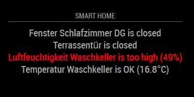

# MMM-Homematic
HomeMatic Module for MagicMirror

This an extension for [MagicMirror](https://github.com/MichMich/MagicMirror) that shows values from [HomeMatic](https://www.homematic.com/) smart home components.

This module makes use of the [XML-API](https://github.com/hobbyquaker/XML-API), which must be installed on your HomeMatic CCU to read the sensor values from.



## Using the module

To use this module, add it to the modules array in the `config/config.js` file:
````javascript
modules: [
	{
		module: 'MMM-Homematic',
		position: 'top_center',
		header: 'SMART HOME',
		config:	{
			ccuHost: 'ccu3-webui',	// hostname of your ccu (e.g. for CCU3 default is "ccu3-webui")
			tempUnit: "°C",			// unit of your temperatur values
			datapoints: [			// the datapoints of your HomeMatic devices/sensors
				{
					id: "2297",
					name: "window Living Room",
					type: "window_warn_open"
				},
				{
					id: "1274",
					name: "humidity Laundry Room",
					type: "hum_warn_high",
					threshold: "60"
				},
				{
					id: "1264",
					name: "temperatur Laundry Room",
					type: "temp_warn_low",
					threshold: "10"
				}
			]
		}
	}
]
````

HomeMatic is a registered trademark of [eQ-3 AG](https://www.eq-3.de/)

## Howto get your datapoint IDs

* Install the XML-API on your HomeMatic CCU. Installation guide can be found here: [XML-API](https://github.com/hobbyquaker/XML-API)

* Call the list of devices via the XML-API using http://ccu3-webui/addons/xmlapi/devicelist.cgi, replacing 'ccu3-webui' with the hostname of your CCU.

* Find the ise_id of your device in the output, which may look like this:
````
<device name="window contact living room" address="001098A98A1C03" ise_id="2086" interface="HmIP-RF" device_type="HmIP-SWDO-I" ready_config="true">
<channel name="window contact living room:0" type="30" address="001098A98A1C03:0" ise_id="2087" direction="UNKNOWN" parent_device="2086" index="0" group_partner="" aes_available="false" transmission_mode="AES" visible="true" ready_config="true" operate="true"/>
<channel name="HmIP-SWDO-I 001098A98A1C03:1" type="37" address="001098A98A1C03:1" ise_id="2115" direction="SENDER" parent_device="2086" index="1" group_partner="" aes_available="false" transmission_mode="AES" visible="true" ready_config="true" operate="true"/>
</device>
````

* Call the state of the device via the XML-API using http://ccu3-webui/addons/xmlapi/state.cgi?device_id=1234, replacing 'ccu3-webui' with the hostname of your CCU and '1234' with the ise_id from the previous step.

* Find the ise_id of the desired datapoint of your device in the output, which may look like this:
````
<code>
<channel name="HmIP-SWDO-I 001098A991646A:1" ise_id="2296">
<datapoint name="HmIP-RF.001098A991646A:1.STATE" type="STATE" ise_id="2297" value="0" valuetype="16" valueunit="""" timestamp="1546779254"/>
</channel>
</code>
````
For window/door contact sensors it is the datapoint of type="STATE", for temperature sensors it is the datapoint with the type="ACTUAL_TEMPERATURE" and for humidity sensors its type="HUMIDITY".

* Use the ise_id from the previous step as ID for your datapoint in the module config.

## Tested devices

<table width="100%">
  <!-- why, markdown... -->
  <thead>
    <tr>
      <th>Type</th>
      <th width="100%">Description</th>
    </tr>
  <thead>
  <tbody>
    <tr>
	  <td>window</td>
	  <td>Homematic IP Window / Door Contact (HmIP-SWDO-I)</td>
	</tr>
    <tr>
	  <td>temp</td>
	  <td>Homematic IP Temperature and Humidity Sensor with Display (HmIP-STHD)</td>
	</tr>
    <tr>
	  <td>hum</td>
	  <td>Homematic IP Temperature and Humidity Sensor with Display (HmIP-STHD)</td>
	</tr>
  </tbody>
</table>

## Configuration options

<table width="100%">
  <!-- why, markdown... -->
  <thead>
    <tr>
      <th>Option</th>
      <th width="100%">Description</th>
    </tr>
  <thead>
  <tbody>
    <tr>
      <td><code>ccuProtocol</code></td>
      <td>The protocol to use for your CCU.
		<br>Most likely default value is good.
        <br><b>Possible values:</b> <code>http://</code> - <code>https://</code>
        <br><b>Default value:</b> <code>http://</code>
      </td>
    </tr>
    <tr>
      <td><code>ccuHost</code></td>
      <td>The hostname of your CCU.
		<br>Depends on your version of CCU.
		<br>For CCU1 you have to give your CCU a fixed IP address and use it.
		<br>For CCU2 it is most likely "homematic-ccu2".
		<br>For CCU3 it is most likely "ccu3-webui" (default).
		<br>For RaspberryMatic it is the hostname you have set in the network settings of your Raspberry PI.
		<br><b>Default value:</b> <code>ccu3-webui</code>
      </td>
    </tr>
    <tr>
      <td><code>ccuXmlApiUrl</code></td>
      <td>The URL path of the XML API.
	    <br>Most likely default value is good.
	    <br>But may change with newer versions of XML API, see [XML-API](https://github.com/hobbyquaker/XML-API).
	    <br><b>Default value:</b> <code>/addons/xmlapi</code>
      </td>
    </tr>
    <tr>
      <td><code>ccuServiceUrl</code></td>
      <td>The name of the XML API Service for getting states/values from devices/datapoints.
	    <br>Most likely default value is good.
	    <br>But may change with newer versions of XML API, see [XML-API](https://github.com/hobbyquaker/XML-API).
	    <br><b>Default value:</b> <code>/state.cgi</code>
      </td>
    </tr>
    <tr>
      <td><code>ccuIdParameter</code></td>
      <td>The name of the URL Parameter expected by the XML API Service to identify a datapoint of a device.
	    <br>Most likely default value is good.
	    <br>But may change with newer versions of XML API, see [XML-API](https://github.com/hobbyquaker/XML-API).
	    <br><b>Default value:</b> <code>?datapoint_id=</code>
      </td>
    </tr>
    <tr>
      <td><code>tempUnit</code></td>
      <td>The unit of temperature.
        <br><b>Possible values:</b> <code>°C</code> - <code>°F</code> - <code>K</code>
        <br><b>Default value:</b> <code>°C</code>
      </td>
    </tr>
    <tr>
      <td><code>humUnit</code></td>
      <td>The unit of humidity.
        <br><b>Possible values:</b> <code>%</code> - <code>g/m³</code>
        <br><b>Default value:</b> <code>%</code>
      </td>
    </tr>
    <tr>
      <td><code>datapoints</code></td>
      <td>An array of datapoint objects.
		<br>Each datapoint object represents one value/state of a device.
		<br><b>Example value:</b>
		<br><code>[{
		<br>id: 1234,
		<br>name: "front door",
		<br>type: window_warn_open,
		<br>},{
		<br>id: 4711,
		<br>name: "humidity laundry room",
		<br>type: "hum_warn_high",
		<br>threshold: "60"
		<br>}]</code>
      </td>
    </tr>
    <tr>
      <td><code>id</code></td>
      <td>The ID of the datapoint to read a value from.
	  <br>This value is required.
	  <br>On howto get your ID see [Howto get your datapoint IDs](#howto-get-your-datapoint-ids).
	  <br><b>Example value:</b> <code>1234</code>
      </td>
    </tr>
    <tr>
      <td><code>name</code></td>
      <td>The display name of the device/datapoint.
	  <br>This value is required.
	  <br><b>Example values:</b> <code>
	  <br>"front door"
	  <br>"temperature living room"</code>
      </td>
    </tr>
    <tr>
      <td><code>type</code></td>
      <td>The type of the device/datapoint.
	  <br>This value is required.
	  <td>Depends on the datapoint/device you want to display.
	  <td>For a list of tested devices see [Tested devices](#tested-devices).
	  <br><b>Possible values:</b>
	  <br><code>window</code> - A door or window sensor. (e.g. a Homematic IP Window / Door Contact)
	  <br><code>window_warn_open</code> - Same as 'window', but with a warning if open.
	  <br><code>window_warn_closed</code> - Same as 'window', but with a warning if closed.
	  <br><code>temp</code> - A temperature sensor. (e.g. a Homematic IP Temperature and Humidity Sensor with Display)
	  <br><code>temp_warn_high</code> - Same as 'temp', but with a warning if value is equal or greater than the threshold.
	  <br><code>temp_warn_low</code> - Same as 'temp', but with a warning if value is equal or less than the threshold.
	  <br><code>hum</code> - A humidity sensor. (e.g. a Homematic IP Temperature and Humidity Sensor with Display)
	  <br><code>hum_warn_high</code> - Same as 'hum', but with a warning if value is equal or greater than the threshold.
	  <br><code>hum_warn_low</code> - Same as 'hum', but with a warning if value is equal or less than the threshold.
	  <br><code>warn_high</code> - A general sensor with a readable number value, with a warning if value is equal or greater than the threshold.
	  <br><code>warn_low</code> - A general sensor with a readable number value, with warning if value is equal or less than the threshold.
      </td>
    </tr>
    <tr>
      <td><code>threshold</code></td>
      <td>A threshold value for displaying a warning.
	  <br>This value is required if you have defined a type with a high/low warning.
	  <br>Must be a number without unit.
      <br><b>Example value:</b> <code>60</code>
	  </td>
    </tr>
    <tr>
      <td><code>initialLoadDelay</code></td>
      <td>The initial delay before loading. If you have multiple modules that use the same API key, you might want to delay one of the requests. (Milliseconds)<br>
        <br><b>Possible values:</b> <code>1000</code> - <code>5000</code>
        <br><b>Default value:</b>  <code>0</code>
      </td>
    </tr>
    <tr>
      <td><code>updateInterval</code></td>
      <td>How often does the content needs to be fetched? (Milliseconds)<br>
        <br>Forecast.io enforces a 1,000/day request limit, so if you run your mirror constantly, anything below 90,000 (every 1.5 minutes) may require payment information or be blocked.<br>
        <br><b>Possible values:</b> <code>1000</code> - <code>86400000</code>
        <br><b>Default value:</b> <code>300000</code> (5 minutes)
      </td>
    </tr>
    <tr>
      <td><code>animationSpeed</code></td>
      <td>Speed of the update animation. (Milliseconds)<br>
        <br><b>Possible values:</b><code>0</code> - <code>5000</code>
        <br><b>Default value:</b> <code>2000</code> (2 seconds)
      </td>
    </tr>
  </tbody>
</table>
